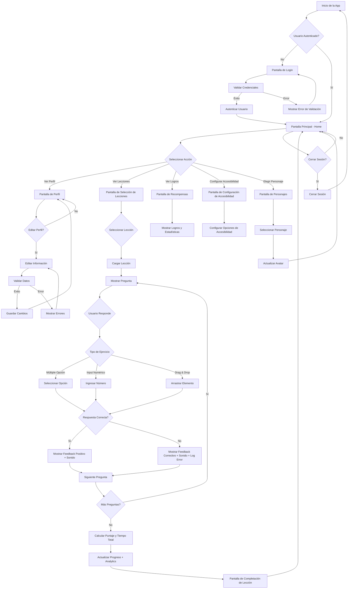

# Diagrama de Flujo del Sistema: "Cuenta Conmigo"

## Descripción del Flujo Actualizado
1. **Inicio**: La app verifica si el usuario está autenticado.
2. **Autenticación**: Si no, muestra login con validación.
3. **Navegación Principal**: Desde Home, el usuario puede acceder a diferentes secciones.
4. **Lecciones Mejoradas**:
   - **Tipos de Ejercicio**: Soporte para múltiple opción, input numérico y drag & drop
   - **Feedback Interactivo**: Sonidos, haptics y explicaciones
   - **Analytics**: Tracking de tiempo total y errores por pregunta
   - **Progreso**: Actualización con métricas detalladas
5. **Perfil**: Vista y edición con validación.
6. **Otras Pantallas**: Logros, accesibilidad, personajes.
7. **Cierre**: Opción para cerrar sesión y volver al inicio.

Este diagrama muestra el flujo completo de la aplicación, destacando la integración de validación de datos, operaciones CRUD, características de accesibilidad, y las nuevas funcionalidades de ejercicios variados y analytics de aprendizaje.
